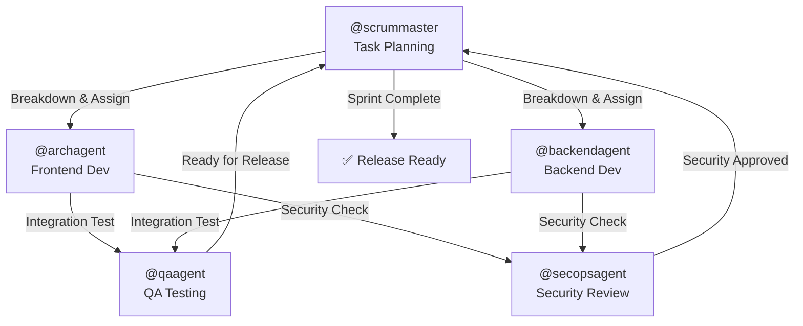

# 🤖 Medical Scheduling App - Agent Ecosystem

> **Multi-Role Development Automation** | Frontend + Backend + DevOps + QA + Scrum Master

---

## 📋 Available Agents

### 0. **@orchestrationagent** - Workflow Coordinator (AUTOMATED) ⭐ NEW
**Location**: `.github/agents/orchestrationagent.agent.md`  
**Workspace**: `scheduling.ui` (Shared)

**When to use:**
- Create features end-to-end (planning → backend → frontend → testing → security)
- Coordinate multiple agents automatically without manual intervention
- Manage dependencies between frontend and backend tasks
- Generate consolidation reports and handoffs

**How it works**: Uses Hooks to automate transitions between phases  
**Example**: `@orchestrationagent coordinar appointment scheduling feature completa`

📖 See [AUTOMATION_GUIDE.md](.github/AUTOMATION_GUIDE.md) for detailed workflow automation details.

---

### 1. **@archagent** - Frontend Angular Specialist
**Location**: `.github/agents/archagent.agent.md`  
**Workspace**: `scheduling.ui` (Frontend)

**When to use:**
- Component/service development (Angular 19)
- NgRx state management (actions, effects, selectors)
- Material Design 3 implementation
- Form validation and dynamic forms
- Routing, Guards, and Interceptors
- TypeScript strict mode issues

**Tools**: `file_search`, `grep_search`, `semantic_search`, `search_workspace_symbols`  
**Example**: `@archagent create a new patient list component with pagination`

---

### 2. **@backendagent** - .NET Backend Specialist *(NEW)*
**Location**: `.github/agents/backendagent.agent.md`  
**Workspace**: `MedPal.API` (Backend)

**When to use:**
- Entity Framework Core models and migrations
- API endpoints (Controllers)
- Service layer implementation
- Repository pattern and data access
- JWT authentication and authorization
- Business logic and validation
- Database schema and relationships

**Tools**: `file_search`, `grep_search`, `semantic_search`  
**Skills**: Entity Framework | Dependency Injection | SOLID principles  
**Example**: `@backendagent create a new endpoint for prescription management`

---

### 3. **@qaagent** - Quality Assurance & Testing Specialist *(NEW)*
**Location**: `.github/agents/qaagent.agent.md`  
**Workspace**: Both (Shared)

**When to use:**
- Unit testing (xUnit, Jasmine)
- Integration testing
- Test case design
- Bug reporting and validation
- Test coverage analysis
- Regression testing
- Performance testing scenarios

**Tools**: `execute`, `read`, `search`, `edit`  
**Skills**: Test automation | Test planning | Defect management  
**Example**: `@qaagent create comprehensive unit tests for UserService`

---

### 4. **@secopsagent** - Security & Operations Specialist *(NEW)*
**Location**: `.github/agents/secopsagent.agent.md`  
**Workspace**: Both (Shared)

**When to use:**
- Security vulnerability assessment
- Authentication/Authorization review
- Data protection and encryption
- API security hardening
- CORS and security headers
- Secrets management
- Multi-tenancy isolation validation
- Dependency vulnerabilities

**Tools**: `read`, `grep_search`, `execute`  
**Skills**: OWASP | JWT security | Data privacy | RBAC validation  
**Example**: `@secopsagent audit the authentication flow for security issues`

---

### 5. **@scrummaster** - Project Coordination & Planning *(NEW)*
**Location**: `.github/agents/scrummaster.agent.md`  
**Workspace**: Both (Shared)

**When to use:**
- Sprint planning and task breakdown
- Progress tracking and reporting
- Sprint retrospectives
- Dependency identification
- Risk assessment
- Team capacity planning
- Daily standup summaries
- Release planning

**Tools**: `read`, `search`  
**Skills**: Agile methodology | Team coordination | Risk management  
**Example**: `@scrummaster create a sprint plan for phase 4 features`

---

## 🔄 Agent Workflow & Coordination

### Typical Development Workflow



### Example: New Feature Development

1. **@scrummaster**
   ```
   Break down new appointment scheduling feature into backend API, frontend UI, and testing tasks
   ```

2. **@backendagent** (in parallel)
   ```
   Create AppointmentController, AppointmentService, Database migrations
   ```

3. **@archagent** (in parallel)
   ```
   Create AppointmentComponent, appointment forms, NgRx store integration
   ```

4. **@qaagent** (after core implementation)
   ```
   Write unit tests, integration tests, create test scenarios
   ```

5. **@secopsagent** (before release)
   ```
   Validate API security, authorization checks, data validation
   ```

6. **@scrummaster** (final verification)
   ```
   Mark as complete, plan next tasks, identify blockers
   ```

---

## 🎯 Agent Specialties & Skills

### Command Examples by Role

#### Frontend Development (@archagent)
```bash
@archagent create a new component for prescription details with form validation
@archagent implement clinic context selector in navigation
@archagent debug why changeDetectionStrategy.OnPush isn't triggering updates
@archagent create an NgRx effect for fetching patient medical history
@archagent implement Material table with sorting and filtering for users list
```

#### Backend Development (@backendagent)
```bash
@backendagent create AppointmentController with CRUD endpoints
@backendagent implement PrescriptionService business logic
@backendagent add multi-tenancy filtering to clinic queries
@backendagent create database migration for appointment scheduling
@backendagent implement permission validation for medical records access
```

#### Testing & QA (@qaagent)
```bash
@qaagent create unit tests for AuthService
@qaagent write integration tests for appointment workflow
@qaagent identify test gaps in the current coverage
@qaagent create test scenarios for RBAC validation
@qaagent analyze code coverage and recommend improvements
```

#### Security & DevOps (@secopsagent)
```bash
@secopsagent audit JWT token validation implementation
@secopsagent review CORS configuration for security
@secopsagent validate multi-tenancy isolation in data access
@secopsagent check for hardcoded secrets or credentials
@secopsagent review API endpoint authorization rules
```

#### Project Management (@scrummaster)
```bash
@scrummaster create sprint plan for patient management feature
@scrummaster identify dependencies between frontend and backend tasks
@scrummaster assess risks in current implementation
@scrummaster generate daily standup summary
@scrummaster plan release for April sprint
```

---

## 🔌 How to Invoke Agents

### Method 1: Direct Invocation (Recommended)
```
@agentname [task description]
```
In VS Code Chat, type `@` and select your agent.

### Method 2: Via Copilot Instructions
Agents auto-activate based on context:
- Working on `.ts` files in `src/app/components/` → **@archagent**
- Working on `.cs` files in `Controllers/` → **@backendagent**
- Writing tests → **@qaagent** suggested
- Reviewing security → **@secopsagent** suggested

### Method 3: Handoffs
Agents can delegate to each other:
```
@archagent I'm blocked on the API contract. Let me handoff to @backendagent
to clarify the endpoint response format.
```

---

## 📊 Agent Configuration Summary

| Agent | Model | Tools | Invocable | Context |
|-------|-------|-------|-----------|---------|
| archagent | Default | Search tools | ✅ Yes | Frontend only |
| backendagent | Default | Search tools | ✅ Yes | Backend only |
| qaagent | Default | Execute + Search | ✅ Yes | Both |
| secopsagent | Default | Read + Search | ✅ Yes | Both |
| scrummaster | Default | Read + Search | ✅ Yes | Both |

---

## 🚀 Getting Started

### Step 1: Verify Agent Files
All agents should exist in `.github/agents/`:
- [ ] `archagent.agent.md` ✅ (already exists)
- [ ] `backendagent.agent.md` (create)
- [ ] `qaagent.agent.md` (create)
- [ ] `secopsagent.agent.md` (create)
- [ ] `scrummaster.agent.md` (create)

### Step 2: Test Each Agent
```bash
@archagent Create a simple "Hello" component
@backendagent Create a simple GET endpoint returning test data
@qaagent Write a unit test for a simple service
@secopsagent Review appsettings.json for exposed secrets
@scrummaster Create a sample sprint backlog
```

### Step 3: Configure Backend Workspace
Create `.github/copilot-instructions.md` in Backend (`MedPal.API`) with:
- .NET 8 / C# conventions
- Entity Framework patterns
- API design principles
- Security guardrails

---

## 💡 Best Practices

### ✅ DO
- Use `@agentname` prefix to activate specialist agents
- Keep agents focused on their domain
- Let @scrummaster coordinate between frontend and backend teams
- Use @qaagent after core features complete
- Run @secopsagent review before merging to main

### ❌ DON'T
- Use generic Copilot for domain-specific work (use specialists instead)
- Mix frontend and backend questions in one message
- Skip security review before release
- Assign testing tasks without @qaagent involvement
- Implement features without @scrummaster approval

---

## 🔗 Related Documentation

- **Frontend Instructions**: `scheduling.ui/.github/copilot-instructions.md`
- **Backend Instructions**: `MedPal.API/.github/copilot-instructions.md` (create)
- **Frontend Agent**: `scheduling.ui/.github/agents/archagent.agent.md`
- **Skills** (to be created): `.github/skills/testing/`, `.github/skills/refactoring/`, etc.

---

## 🤝 Team Structure

**Recommended Team Assignment:**

```
Dev Team:
├─ Frontend Developer → @archagent (primary)
├─ Backend Developer → @backendagent (primary)
│
QA Team:
├─ QA Engineer → @qaagent (primary)
│
DevOps Team:
├─ Security Engineer → @secopsagent (primary)
│
Management:
├─ Scrum Master → @scrummaster (primary)
└─ Product Owner → @scrummaster (secondary)
```

---

**Last Updated**: March 22, 2026  
**Version**: 1.0  
**Status**: Production Ready
